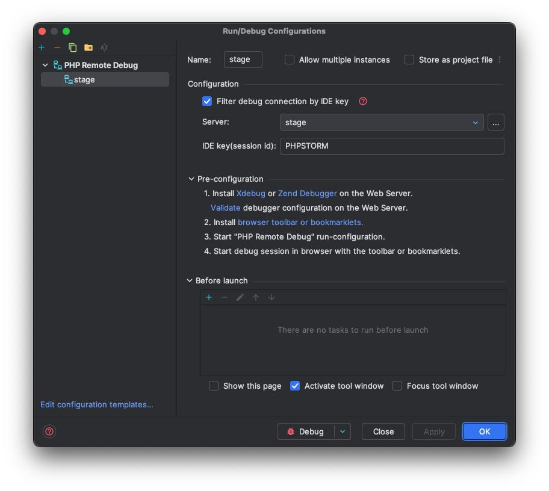

# xDebug & PhpStorm (Docker)

This guide helps you set up xDebug inside a Docker container with PhpStorm for local debugging.

> ⚠️ Note: If you're using the default Docker setup from `make up`, xDebug is already installed and configured.

---

## ⚙️ xDebug PHP Configuration

Ensure `xdebug` is installed in your Docker image. Inside `Dockerfile`:

```dockerfile
RUN pecl install xdebug && docker-php-ext-enable xdebug
```

In your `php.ini` (or custom config loaded in Docker):

```ini
zend_extension=xdebug.so
xdebug.mode=debug
xdebug.start_with_request=yes
xdebug.client_host=host.docker.internal
xdebug.client_port=9003
```

> 🔧 Port `9003` is the default PhpStorm debugger port.

---

## 🐳 docker-compose.yml

Ensure the following settings are present:

```yaml
services:
  app:
    environment:
      PHP_IDE_CONFIG: "serverName=app"
      XDEBUG_MODE: "debug"
      XDEBUG_CONFIG: "client_host=host.docker.internal"
    volumes:
      - ./:/var/www/html
```

---

## 🧐 PhpStorm Configuration

1. **Preferences → PHP → Servers**

   * Name: `stage`
   * Host: `localhost`
   * Port: `8080` (or `80`, depending on your RR/HTTP setup)
   * Path Mappings: map `/var/www` to your local project path

2. **Preferences → PHP → Debug**

   * Debug port: `9003`
   * Enable: "Start Listening for PHP Debug Connections"

3. Set a breakpoint and launch your application using `make up` or `./vendor/bin/rr serve`

<details>
  <summary>xDebug config screens</summary>





</details>

<details>
  <summary>PHP Interpreter config screens</summary>


</details>

---

## ✅ Testing

Open your app in the browser and trigger a route that hits a breakpoint. PhpStorm should automatically pause execution and open the debugger panel.


